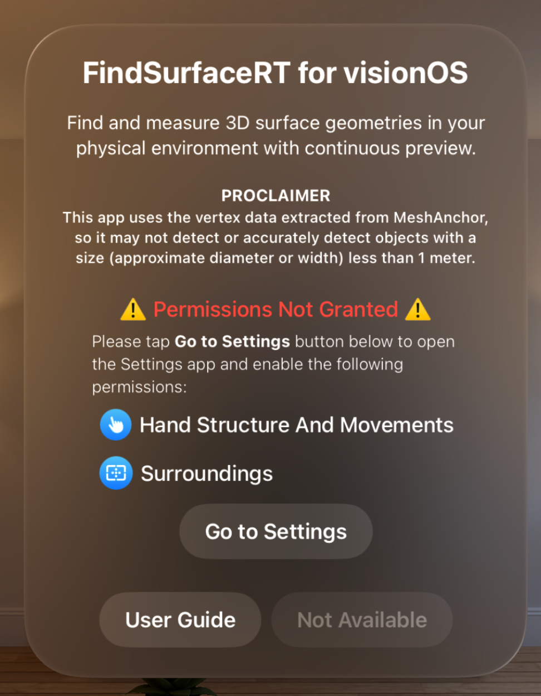
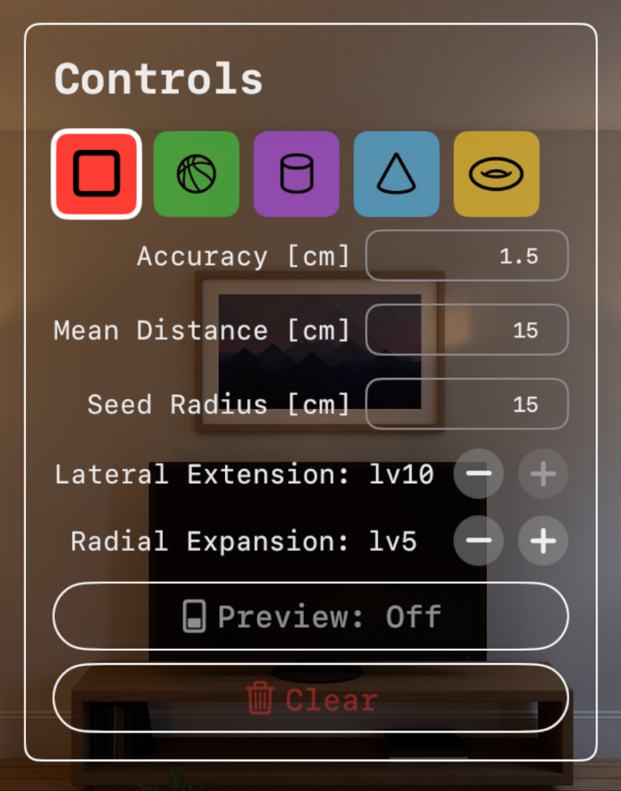
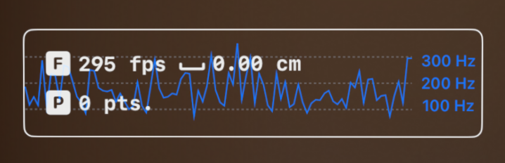

# FindSurface-RealityKit-visionOS-Real-Time

**Curv*Surf* FindSurface™ Real-time demo app for visionOS (Swift)**

## Overview

This demo app demonstrates a sample project that searches vertex points (provided by ARKit as mesh anchors) for geometry shapes continuously fully utilizing features of [FindSurface-visionOS](https://github.com/CurvSurf/FindSurface-visionOS/tree/main) package. This is a minimized and optimized version of [FindSurface-RealityKit-visionOS-Response-to-Request](https://github.com/CurvSurf/FindSurface-RealityKit-visionOS-Response-to-Request).

This app introduces `Preview mode` that makes it continuously invoke FindSurface without any delay, searching for geometry shapes from mesh points around the center of your sight. If found, it displays a 3D model of the detected shape transiently as a preview. Spatial tap will **capture** and **freeze** the previewed geometry.

As mentioned in [here](https://github.com/CurvSurf/FindSurface-visionOS#overview), FindSurface-visionOS limits the number of input points to less than 50k.

## Requirements

The app runs on an Apple Vision Pro (visionOS 2.0+) device only, and requires your permissions to track your hands and to scan your environment (world sensing) to operate as intended. Dialogs asking the permissions will be prompted upon launching the app.

## How to use

After launching the app, Startup window will open. Click on `Enter` button to open the immersive space.

The device will start scanning your physical environment and generate mesh anchors. A black sphere will float in front of you to indicate the center of your sight. Unlike [our previous app](https://github.com/CurvSurf/FindSurface-RealityKit-visionOS), which utilizes eye-tracking position, the seed point location is determined by ray casting with the device location and the direction of CoP (center of projection) in your sight in `Preview mode` of this app. This indicator helps you aim at the place to search for geometries in `Preview mode`. The triangle hit by the ray casting will be highlighted in green.

### Startup window

- `User Guide` displays you this page (this README.md file) in the app, thanks to the [swift-markdown-ui package](https://github.com/gonzalezreal/swift-markdown-ui).
- `Enter` starts the immersive space.

If you have never clicked `Don't allow` on the permission dialog, you won't see the `Permission Not Granted` section. It only shows up when you disallowed the necessary permissions. `Go to Settings` button will lead you to this app's section in the Settings app. After all the necessary permissions are granted, the `Enter` button will be enabled and it will restart the app when you click it.

### Controls Window

Controls window provides you with app controls that you will frequently access while using the app. It will be displayed on the right side of your sight and can be relocated by pinching with the middle finger and thumb of your right hand.

- Feature type picker: The five shape icons are the feature types that can be selected to search for using FindSurface.

- `Accuracy` represents the *a priori* root-mean-squared error of vertices of meshes.
- `Mean Distance` represents the average distance between the vertices.
- `Seed Radius` specifies the approximate radius of the region of interest (depending on the estimated size of the object to be detected). You can adjust this value by tapping the thumb and index finger of both hands together and moving your hands apart or closer.
- `Lateral Extension` represents the tendency for the algorithm to spread its search space in lateral (tangential) direction of the surface to be detected or measured.
- `Radial Expansion` represents the tendency for the algorithm to thicken/thin its search space in normal direction of the surface to be detected or measured.

For detailed explanations of the parameters, please refer to [FindSurface](https://github.com/CurvSurf/FindSurface#how-does-it-work).

For the recommended preset of the parameters, please refer to [Optimal Parameter Set for Apple Vision Pro](https://github.com/CurvSurf/FindSurface-visionOS#optimal-parameter-set-for-apple-vision-pro).

- `Preview` enables/disables `Preview mode`, which calls FindSurface's detection function without any delay between the invocations. While the preview mode is enabled, spatial taps on meshes capture the current preview geometry.

- `Clear` removes all the captured geometries in the scene.

#### Status View

- `F` and fps stand for 'found-per-second', which is calculated from the average of time-intervals between the events that FindSurface detects a geometry.
- `P` and pts mean the number of points that FindSurface receives as input, which are obtained from the surroundings of user.
- Fps graph: When `Preview mode` is enabled, the change of the fps will be plotted on the background of the status view (not included in the screenshot above).
    > **Note**: '**found-per-second**' means how frequently the information about geometries around you are provided, but doesn't mean any performance score such as frame-per-second of when talking about how well GPUs perform. Also note that the X-axis of Fps graph is not related to the time scale but rather just records changes in fps only when the events occur.

## Invoking FindSurface package's APIs

This section explains how to detect geometry using `FindSurface-visionOS` package's APIs in source code.

To detect geometry using FindSurface, at least two steps are necessary: the first is to specify parameters that correspond to the environment and target geometry. The parameters can be adjusted in the control window, as explained above. The second is to define a seed point from which the search in the point cloud obtained from the environment will begin. This process involves ray casting towards the direction of a point shown at the center of the screen. The ray picks a triangle and then the closest point among its three vertices will be used as the seed point.

https://github.com/CurvSurf/FindSurface-RealityKit-visionOS-Real-Time/blob/69da589566f36307120a64eeaeeea6597b64735f/FindSurfaceRT-visionOS/App/AppState.swift#L203-L209

The `meshVertexManager.raycast` function performs ray casting using the position and direction of the user device (`DeviceAnchor`). The direction is slightly adjusted about 10 degree below the center of the screen to align with the user's sight. The `nearestTriangleVertices` function returns the tree vertices of the triangle in a form of tuple of `simd_float3`. The vertices are sorted by their distance from the ray (`points.0` is nearest). 

Once these steps are completed, the API can be called as follows:

https://github.com/CurvSurf/FindSurface-RealityKit-visionOS-Real-Time/blob/69da589566f36307120a64eeaeeea6597b64735f/FindSurfaceRT-visionOS/App/AppState.swift#L220-L235

Due to the limitation of the FindSurface's current implementation, FindSurface does not support multithreading. Therefore, if multiple threads call FindSurface's detection function simultaneously, unexpected behavior may occur.

To prevent this, `perform` method ensures that if FindSurface is already running, it will neither execute the provided closure nor start another detection, and it will immediately return nil. This mechanism helps prevent other threads from invoking FindSurface while one is already in progress.

In this project, FindSurface is called in an infinite loop on a single thread, so this issue shouldn't arise. However, in order to emphasize the importance of avoiding such problems, `criticalSection` wrapper function has been implemented using a semaphore. In practice, this semaphore will never stall in the `wait` method.

Once the `perform` function returns a `result` that is not `nil`, you can use it for rendering or verifying the measured values. For methods to query the measured values, refer to other examples, such as [FindSurface-RealityKit-visionOS-Response-to-Request](https://github.com/CurvSurf/FindSurface-RealityKit-visionOS-Response-to-Request).

